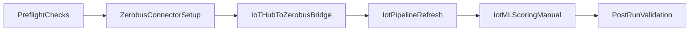

# Demo Automation Plan (No Build Yet)

## Objective
Create a single, reliable demo workflow that automates the full path:
Arduino -> Azure IoT Hub -> Zerobus ingest -> DLT medallion -> ML scoring -> SQL/Genie-ready outputs.

This document is a build plan only. No implementation is performed by this document.

## Current State Snapshot
- Ingest setup job exists: `zerobus_connector_setup_${bundle.target}`.
- IoT bridge job exists: `iothub_to_zerobus_bridge_${bundle.target}`.
- DLT refresh job exists: `iot_pipeline_refresh_${bundle.target}`.
- ML job exists: `iot_ml_scoring_manual_${bundle.target}`.
- DLT pipeline is continuous in `resources/pipelines.yml`.
- Bundle variables/secrets for Zerobus and IoT Hub are present in `databricks.yml`.

## Target End State
One top-level orchestration job (for example `iot_demo_realtime_workflow_${bundle.target}`) that:
1. Validates prerequisites and secrets.
2. Ensures Zerobus target stream/table exist.
3. Runs IoT Hub -> Zerobus bridge ingestion.
4. Refreshes DLT medallion pipeline.
5. Runs ML scoring tasks.
6. Runs post-run data quality/volume checks.
7. Fails fast with actionable messages if any stage is unhealthy.

## Proposed Orchestration Flow

## Implementation Plan

### Phase 1: Add Master Workflow Job
- Add a new job resource in `resources/jobs.yml`:
  - `iot_demo_realtime_workflow`
  - Task chain with explicit `depends_on`:
    - `preflight_checks` (new lightweight Python task)
    - `setup_zerobus_ingest` (reuse existing script)
    - `bridge_iothub_to_zerobus` (reuse existing script)
    - `update_medallion_pipeline` (existing pipeline task)
    - `anomaly_scoring` and `fault_prediction` (reuse ML tasks)
    - `validate_outputs` (new lightweight Python or SQL task)
- Keep existing standalone jobs for debugging and ad hoc reruns.

### Phase 2: Add Preflight + Validation Scripts
- Add `databricks/preflight_checks.py`:
  - Verify required secrets exist and are readable:
    - `zerobus_sp_client_id`
    - `zerobus_sp_client_secret`
    - `iothub_eventhubs_connection_string`
  - Verify target UC path exists and is writable:
    - `${var.catalog}.${var.schema}.${var.raw_input_table}`
  - Validate essential bundle variables are non-empty.
- Add `databricks/validate_demo_outputs.py`:
  - Assert row-count thresholds after run:
    - `raw_iothub_messages > 0`
    - `bronze_iot_raw > 0`
    - `silver_machine_telemetry > 0`
  - Optional warning-only check for `gold_machine_health_5m` depending on watermark/window timing.
  - Print concise metrics for demo narration.

### Phase 3: Tune Demo Run Modes
- Define two run profiles (bundle target variable-driven):
  - **`demo_realtime` mode**:
    - Frequent orchestration schedule (for example every 1-2 minutes) or on-demand run button.
    - Short ML cadence (every run or every N runs).
  - **`demo_backfill` mode**:
    - Reset checkpoint option for replay.
    - Forced bridge run from earliest offsets for recovery.
- Keep DLT continuous and treat job-run as synchronization points for demo certainty.

### Phase 4: Demo-Day Operationalization
- Update `README.md` with one-click runbook:
  - `databricks bundle deploy -t dev --auto-approve`
  - `databricks bundle run -t dev iot_demo_realtime_workflow`
- Add failure playbook section:
  - If bridge fails: rerun bridge-only.
  - If silver remains zero: rerun bridge then pipeline refresh.
  - If ML fails: rerun ML-only while preserving ingest/pipeline results.

## Acceptance Criteria
- One workflow job executes full chain without manual intervention.
- Each stage is dependency-gated and fails with a clear error.
- Post-run validation reports counts for raw/bronze/silver/gold and ML outputs.
- Demo operator can run a single command to execute the entire workflow.

## Non-Goals
- No refactor of Arduino firmware in this phase.
- No migration away from current IoT Hub + bridge architecture in this phase.
- No production hardening beyond demo reliability requirements.

